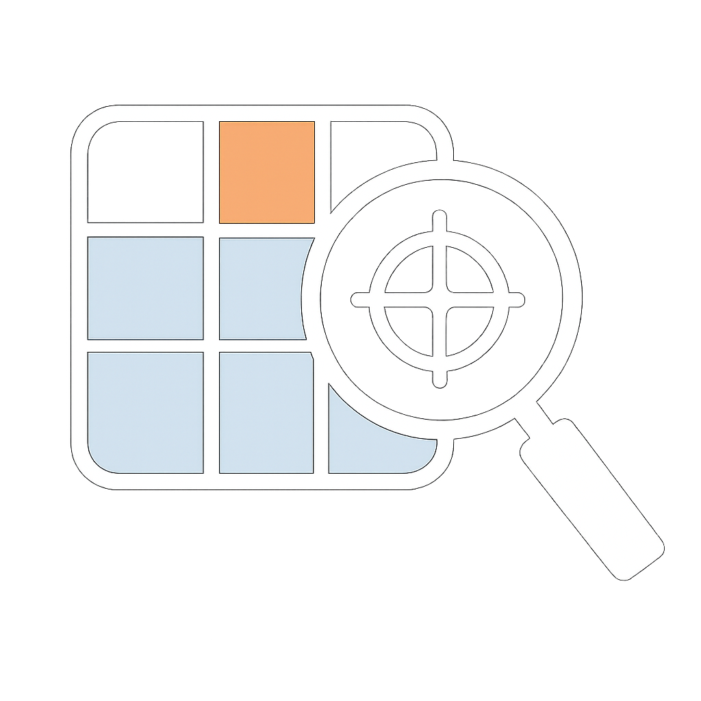

#  Look Where It Matters

### Training-Free Ultra-HR Remote Sensing VQA via Adaptive Zoom Search

 

**Yunqi Zhou**1* &nbsp;·&nbsp; **Chengjie Jiang**2* &nbsp;·&nbsp; **Chun Yuan**2 &nbsp;·&nbsp; **Jing Li**3†

1 Central University of Finance and Economics &nbsp;&nbsp; 2 Tsinghua University &nbsp;&nbsp; 3 East China Normal University

* Equal Contribution &nbsp;&nbsp; † Corresponding Author

 

&nbsp;&nbsp;

